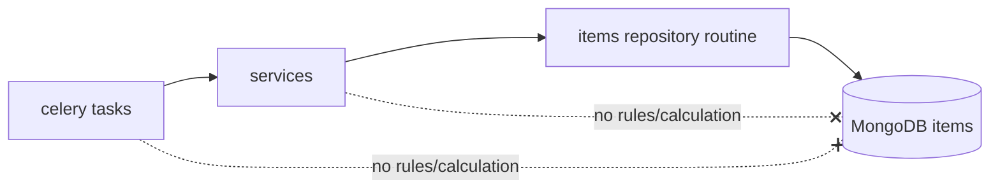

# Architecture Spine — Ajuste do Fluxo de Torrent Failure/Dying/Dead

## Design Paradigm

Layered architecture existente no backend Python (celery tasks -> services -> repositories -> MongoDB).

## Invariants & Rules

### AD-1 — Rotina única atômica para manutenção de saúde do torrent

- **Binds:** FR-001, FR-002, FR-003, FR-005, FR-006
- **Prevents:** divergência entre pontos de atualização e estados derivados inconsistentes
- **Rule:** todo fluxo que atualizar saúde deve chamar uma única rotina canônica no repository que execute, em um único update pipeline por item, poda de history expirado e recálculo completo de campos derivados.

### AD-2 — Janela temporal e contagem canônica

- **Binds:** FR-002, FR-004, FR-006
- **Prevents:** off-by-one temporal e contagem por evento em vez de dias únicos
- **Rule:** considerar apenas ocorrências válidas com occurred_at >= now-7d (UTC), descartar inválidas/futuras, e calcular failure_days por dias distintos.

### AD-3 — Responsabilidade de fronteira entre task e repository

- **Binds:** FR-001, FR-003, FR-005
- **Prevents:** duplicação de lógica temporal nas tasks e divergência entre paths de sucesso/falha
- **Rule:** tasks/services não calculam estado derivado; elas apenas disparam a rotina canônica de manutenção no repository em todos os ciclos relevantes (com falha e sem falha).

### AD-4 — Sequência canônica de atualização

- **Binds:** FR-001, FR-002, FR-003, FR-004
- **Prevents:** leituras intermediárias inconsistentes e estado parcial persistido
- **Rule:** a rotina canônica segue ordem fixa: normalizar entrada -> podar history inválido/expirado -> recalcular failure_days -> derivar flags dying/dead -> persistir updated_at no mesmo fluxo.



## Consistency Conventions

| Concern | Convention |
| --- | --- |
| Naming (entities, files, interfaces, events) | Manter nomenclatura atual: torrent_failure_history, torrent_failure_days, torrent_is_dying, torrent_is_dead. |
| Data & formats (ids, dates, error shapes, envelopes) | occurred_at em UTC; comparação temporal canônica por now-7d. |
| State & cross-cutting (mutation, errors, logging, config, auth) | Atualização atômica por item; logs técnicos para descartes por dado inválido. |

## Stack

| Name | Version |
| --- | --- |
| Python | >=3.13,<4.0 |
| FastAPI | >=0.116.1,<0.117.0 |
| Celery | >=5.5.3,<6.0.0 |
| Motor | >=3.7.1,<4.0.0 |

## Structural Seed

```text
betor/
  celery/tasks.py                       # tasks que chamam services e tratam paths de erro
  services/update_item_torrent_info_service.py
  services/update_item_torrent_trackers_info_service.py
  repositories/items_repository.py      # rotina canônica de manutenção de health fields
tests/
  betor/celery/test_torrent_failure_tasks.py
  betor/repositories/test_items_repository.py
```

## Capability -> Architecture Map

| Capability / Area | Lives in | Governed by |
| --- | --- | --- |
| FR-001 Recalcular sem nova falha | celery tasks + items_repository | AD-1, AD-3, AD-4 |
| FR-002 Limpeza automática >7d | items_repository | AD-1, AD-2, AD-4 |
| FR-003 Consistência estado derivado | items_repository | AD-1, AD-3, AD-4 |
| FR-004 Bordas de histórico | items_repository | AD-2, AD-4 |
| FR-005 Idempotência | items_repository + testes | AD-1, AD-3 |
| FR-006 Dias únicos | items_repository | AD-2 |

## Deferred

- Detalhamento de estratégia de rollout/migração para histórico já inflado fica para plano de implementação.
- Definição fina de métricas e dashboards de observabilidade fica para fase de implementação.
- Forma exata de instrumentação de logs e counters (nomenclatura e cardinalidade) fica para a história de observabilidade.
